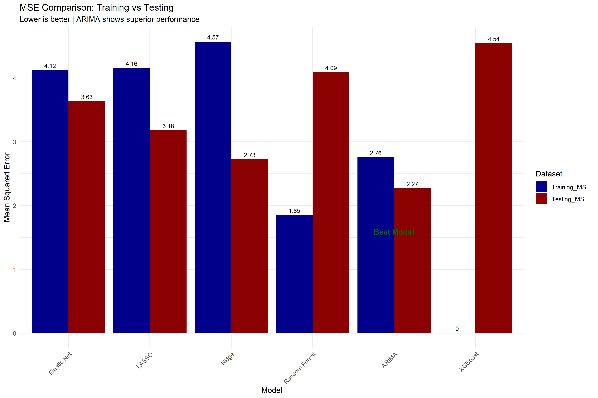
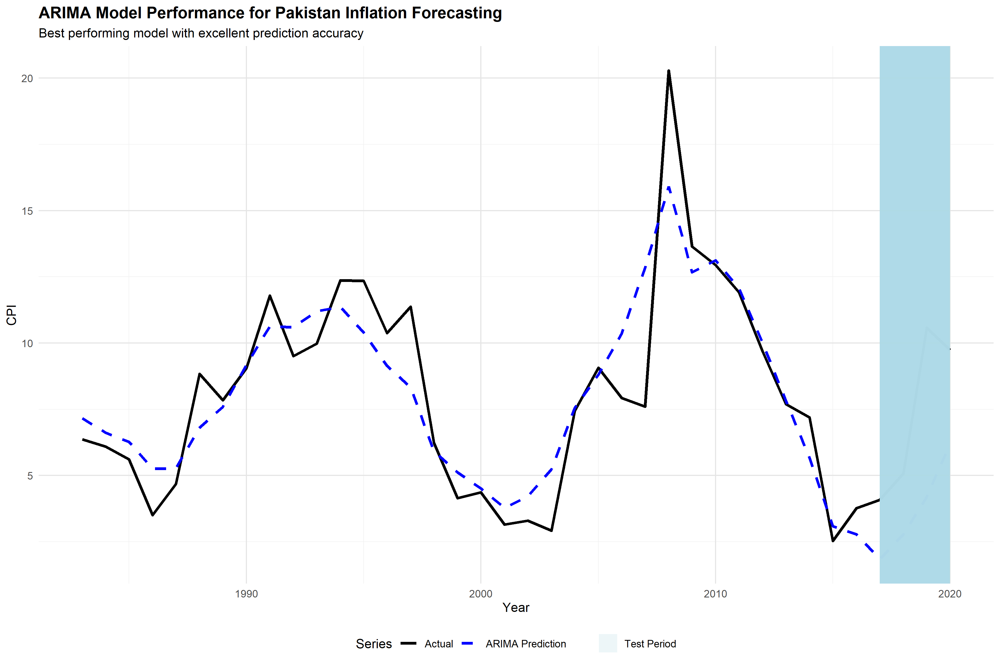
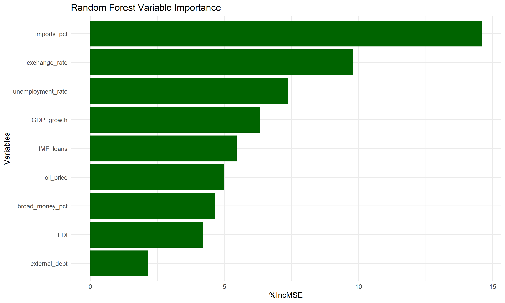
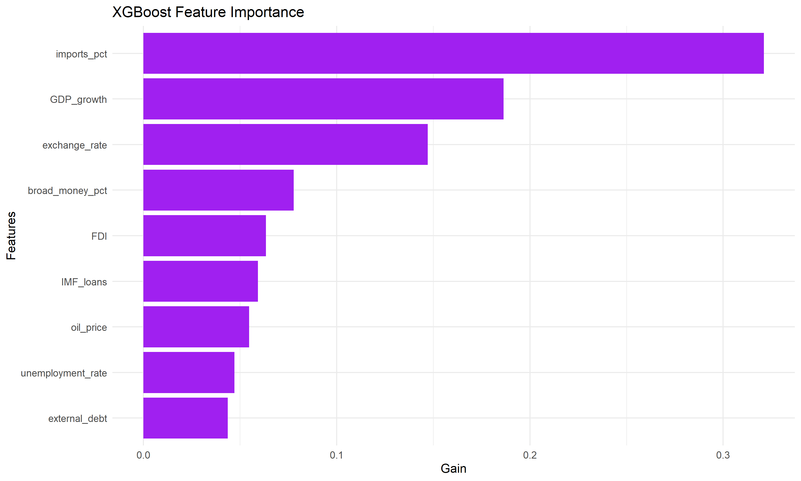

# Inflation Forecasting Using ARIMA, XGBoost, and Random Forest

A comparative forecasting project that evaluates classical time-series and machine-learning approaches for inflation prediction. The repository contrasts ARIMA, XGBoost, and Random Forest using supporting plots, performance summaries, and a documented R-based workflow.

## Overview

This project studies inflation forecasting through a model-comparison lens. Instead of relying on a single method, it evaluates:

- ARIMA for traditional time-series modeling
- XGBoost for boosted tree-based forecasting
- Random Forest for nonlinear ensemble prediction

The goal is to compare their predictive behavior and interpret which approach performs better under the dataset used in the study.

## Repository Contents

- `project_code.r`: main implementation
- `project_documentation.pdf`: project report
- `dataset (2).csv`: dataset used in the analysis
- `model_comparison.csv`: summarized model results
- supporting plots and diagnostics for performance, correlation, distributions, and feature importance

## Visual Highlights

| Model Comparison | ARIMA Performance |
| --- | --- |
|  |  |

| Random Forest Importance | XGBoost Importance |
| --- | --- |
|  |  |

## Analysis Areas

The repository includes evidence for:

- model error comparison
- correlation analysis
- distribution and boxplot exploration
- training and testing performance review
- variable-importance interpretation for tree-based models

## Why This Project Matters

This is a useful portfolio project because it demonstrates:

- forecasting model comparison
- combination of statistical and machine-learning methods
- R-based analytical workflow
- model interpretation through plots and importance metrics
- evidence-backed evaluation instead of a single claimed best model

## Running the Project

The main implementation is in:

```text
project_code.r
```

Typical workflow:

1. open the R script in RStudio or another R environment
2. load the dataset
3. run preprocessing and model sections
4. regenerate plots and comparison outputs

## Current Repository Status

This repository is best positioned as a comparative forecasting study and portfolio artifact rather than a deployed application. Its strength lies in the analytical workflow, model comparison, and documented outputs.

## Author

Abubakar Shahid  
GitHub: <https://github.com/abubakarshahid16>
